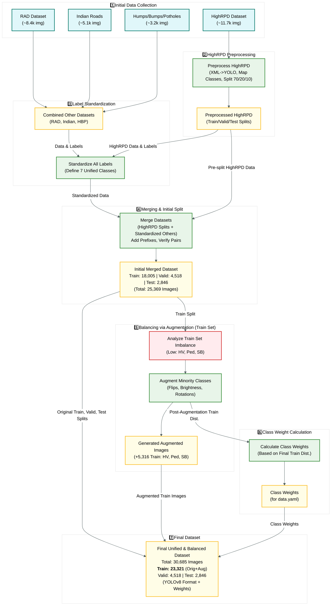
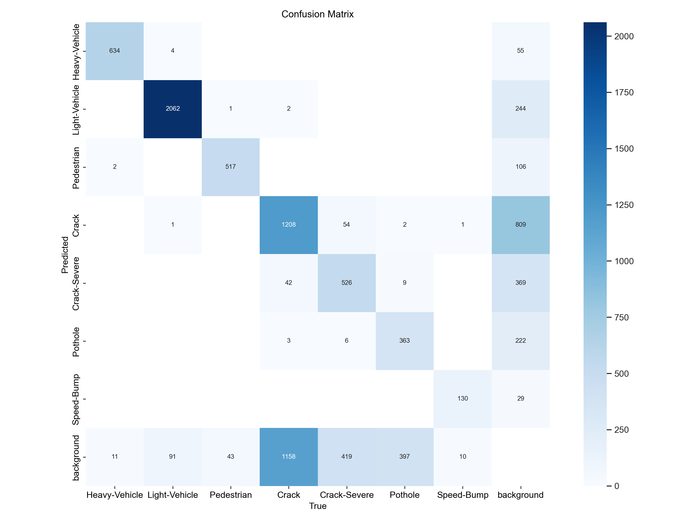
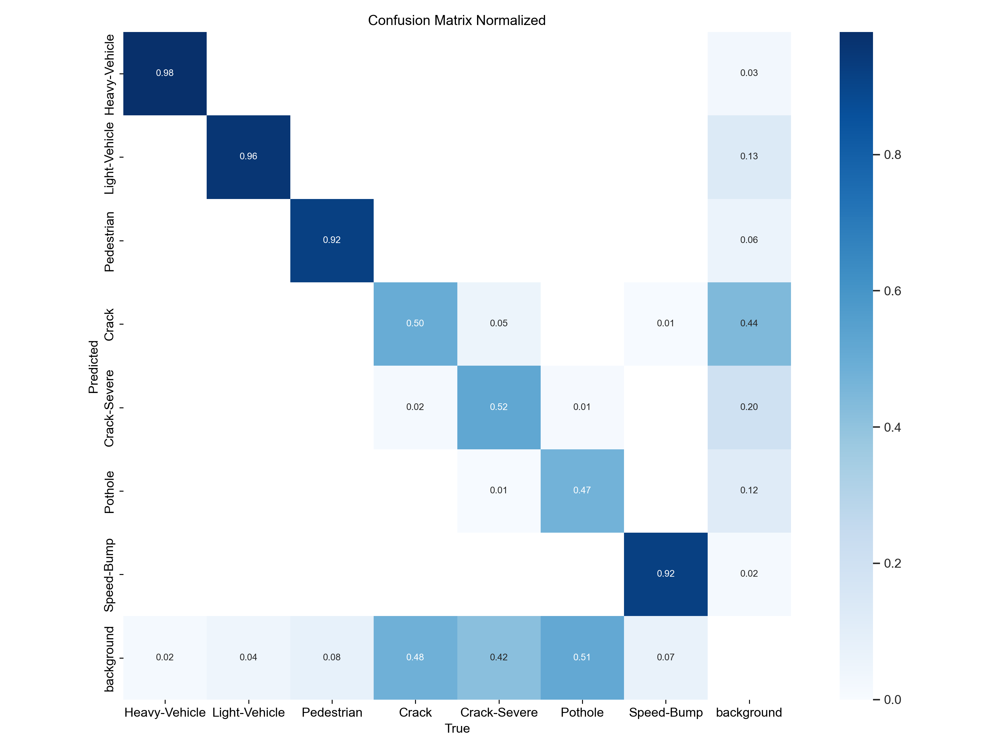
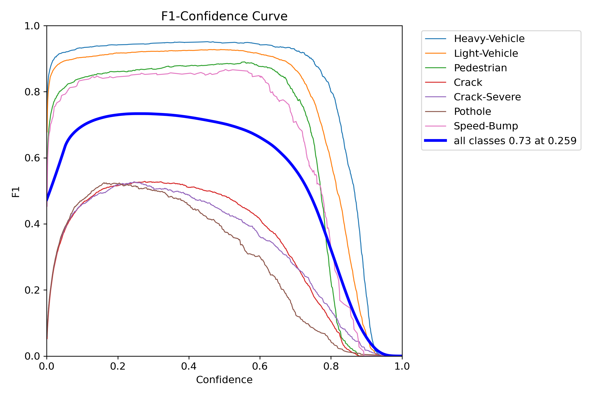
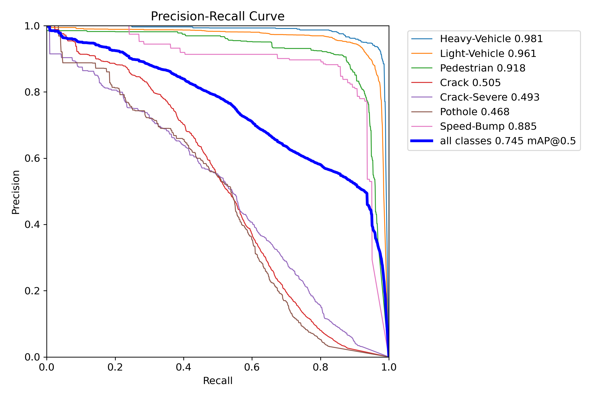
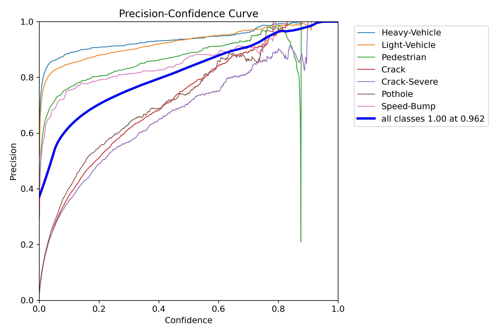
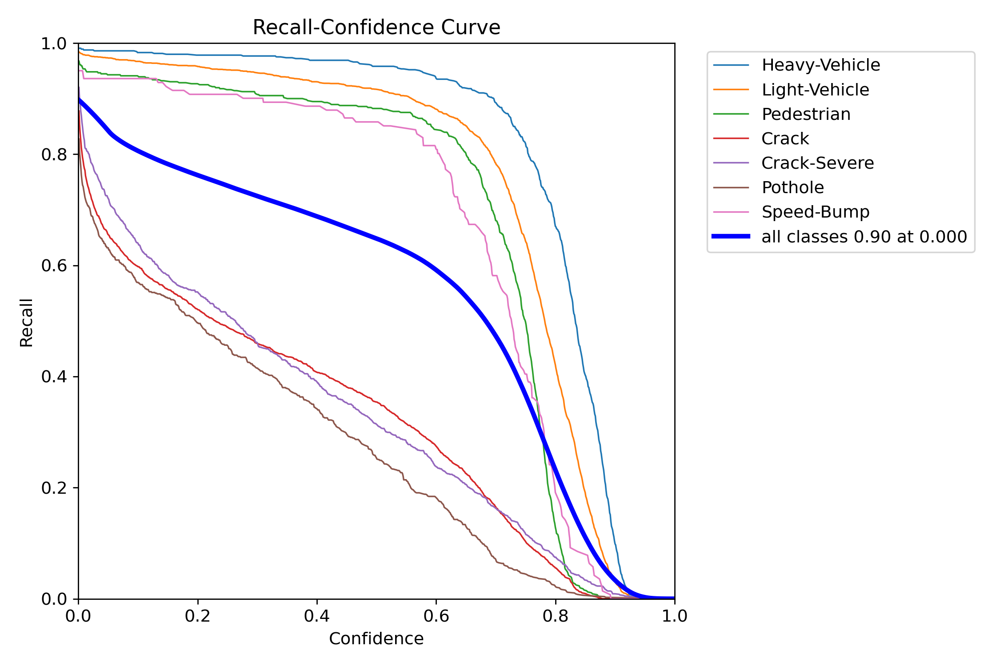
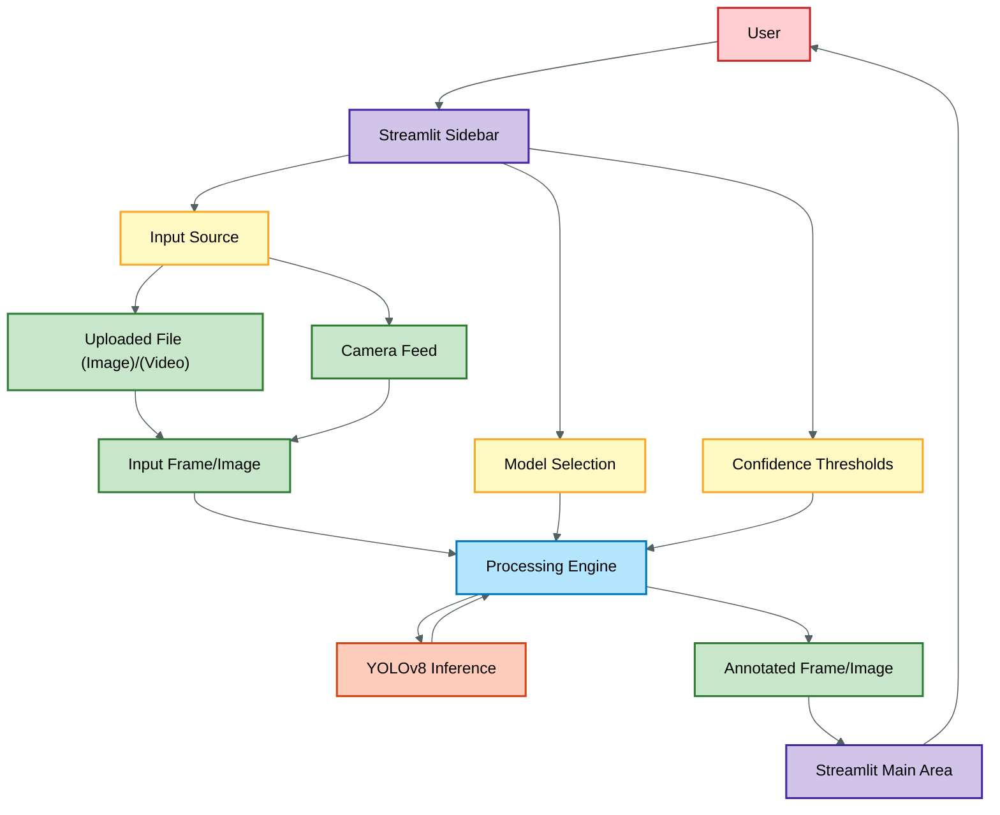

# Road Anomaly Detection

Our Road Anomaly Detection project. We've been working on using computer vision, specifically YOLOv8 models, to automatically spot issues like cracks and potholes on road surfaces. This repository contains the dataset details, the models we trained and used, evaluation results, and the demo applications we built.


## Dataset

We put together a custom dataset specifically for training our main detection model. The whole process, from sourcing data to annotation, is documented if you're curious about the nitty-gritty details.

*   **Dataset Creation Documentation:** [Read the full process here](https://docs.google.com/document/d/1ICyVPLAKgyiLljKMv-1-_pa14pUD2c5RarL6ku9r8X0/edit?usp=sharing)

The dataset structure within this repository looks like this:

```tree
dataset/
├── test/
│   ├── images/
│   └── labels/
├── train/
│   ├── images/
│   └── labels/
└── valid/
    ├── images/
    └── labels/
```
<!--  -->



## Model 1: Custom Trained YOLOv8m (`best.pt`)

This is the primary model we trained from scratch using our custom dataset.

*   **Model Architecture:** YOLOv8m
*   **Training Epochs:** 120
*   **Training Time:** Approx. 27.8 hours
*   **Hardware:** NVIDIA GeForce RTX 3060 Laptop GPU (6GB)
*   **Best Weights File:** `RoadDetectionModel/RoadModel_yolov8m.pt_rounds120_b9/weights/best.pt` (Size: 52.0 MB)
*   **Repository:** [Based on this structure](https://github.com/collabdoor/Road-Anomaly-Detection)

### Validation Performance (`best.pt` during training)

These metrics reflect the performance on the validation set using the best weights saved during the training process.

| Class         | Precision | Recall | mAP@.5 | mAP@.5:.95 |
| :------------ | :-------- | :----- | :----- | :--------- |
| **Overall**   | **0.738** | **0.726** | **0.733** | **0.443** |
| Heavy-Vehicle | 0.921     | 0.976  | 0.979  | 0.764      |
| Light-Vehicle | 0.894     | 0.965  | 0.967  | 0.659      |
| Pedestrian    | 0.838     | 0.903  | 0.910  | 0.494      |
| Crack         | 0.553     | 0.430  | 0.454  | 0.219      |
| Crack-Severe  | 0.526     | 0.467  | 0.471  | 0.265      |
| Pothole       | 0.595     | 0.432  | 0.432  | 0.171      |
| Speed-Bump    | 0.842     | 0.911  | 0.919  | 0.530      |

*   *Validation results saved in:* `RoadDetectionModel/RoadModel_yolov8m.pt_rounds120_b9`

### Test Set Performance (`best.pt` - Final Evaluation)

We ran a final evaluation on a dedicated test set using the `best.pt` model.

| Class         | Precision | Recall | mAP@.5 | mAP@.5:.95 |
| :------------ | :-------- | :----- | :----- | :--------- |
| **Overall**   | **0.736** | **0.740** | **0.745** | **0.448** |
| Heavy-Vehicle | 0.913     | 0.978  | 0.981  | 0.763      |
| Light-Vehicle | 0.892     | 0.951  | 0.961  | 0.649      |
| Pedestrian    | 0.822     | 0.915  | 0.918  | 0.522      |
| Crack         | 0.576     | 0.484  | 0.505  | 0.240      |
| Crack-Severe  | 0.548     | 0.503  | 0.493  | 0.273      |
| Pothole       | 0.597     | 0.440  | 0.468  | 0.198      |
| Speed-Bump    | 0.804     | 0.908  | 0.885  | 0.487      |

*   **Average Inference Speed:** ~12.0 ms per image
*   *Test results saved in:* `runs/detect/val3`

# **Sample Processed Video:** [Watch a sample here](https://www.youtube.com/watch?v=W_SFcuZuRBE)

#### Overall Test Metrics Summary:

*   **Precision:** 0.736
*   **Recall:** 0.740
*   **mAP@0.5:** 0.745
*   **mAP@0.5:0.95:** 0.448
*   **F1-Score:** 0.738 (Calculated as 2 * (P * R) / (P + R))

### Test Set Evaluation Visualizations (Model 1 - `best.pt`)

Here are some charts generated during the final test set evaluation:

<table>
  <tr>
    <td></td>
    <td></td>
    <td></td>
  </tr>
  <tr>
    <td></td>
    <td></td>
    <td></td>
  </tr>
</table>

*(Images sourced from `runs/detect/val3`)*

## Model 2: Pre-trained YOLOv8s (`YOLOv8_Small_2nd_Model.pt`)

We also incorporated a second, pre-trained model for comparison and potential fusion.

*   **Model File:** `YOLOv8_Small_2nd_Model.pt`
*   **Model Architecture:** YOLOv8s
*   **Source Repository:** [oracl4/RoadDamageDetection](https://github.com/oracl4/RoadDamageDetection)
*   **Training Data:** CRDDC2022 Dataset
*   **Detected Classes:** `Longitudinal Crack`, `Transverse Crack`, `Alligator Crack`, `Potholes`

## Demo Applications

We've built a couple of interfaces to showcase the models in action.

### Streamlit Web App

This is our main demo app, allowing you to test the models easily.

*   **Functionality:** Detect anomalies in uploaded images, videos, or a live camera feed ("Dash Cam").

<!--  -->



*   **Features:**
    *   Choose between Model 1 (`M1`) and Model 2 (`M2`) or use both.
    *   Adjust the confidence threshold for each model independently.
    *   View detections overlaid on the input. M1 detections are in **RED**, M2 detections are in **BLUE**.
*   **Live Demo:** [**Try it out here!**](https://road-anomaly-detection.streamlit.app/)

### Flask Interface App (Under Construction)

We started building a Flask-based interface as well.

*   **Location:** `interface-app/`
*   **Status:** This app is currently under development and not fully functional yet.

## Project Structure

Here's a glance at how the project files are organized:

```
C:.
│   .gitignore
│   do this setup.md
│   main.py
│   packages.txt
│   README.md
│   requirements.txt
│   run.py
│   run2model.py
│   train.ipynb
│   visualize_annotations_data.py
│   web interface.md
│   yolo11n.pt
│   yolov8m.pt
│   YOLOv8_Small_2nd_Model.pt
│
├───.devcontainer
│       devcontainer.json
│
├───.streamlit
│       config.toml
│
├───.vscode
│       settings.json
│
├───dataset
│   ├───test
│   │   ├───images
│   │   └───labels
│   ├───train
│   │   ├───images
│   │   └───labels
│   └───valid
│       ├───images
│       └───labels
│
├───inference_output
│       India_000884_jpg.rf.7d8d1739a4debaece30cbe543980de9c_annotated.jpg     
│
├───inference_output_two_models
│       v_annotated_2models.mp4
│
├───interface-app
│   │   app.py
│   │   requirements.txt
│   │   ... (static, templates folders)
│
├───RoadDetectionModel
│   └───RoadModel_yolov8m.pt_rounds120_b9
│       │   args.yaml
│       │   confusion_matrix.png
│       │   ... (other training/validation outputs)
│       │
│       └───weights
│               best.pt
│               last.pt
│
└───runs
    └───detect
        ├───val
        │    ... (older Test Set Evaluation Metrics)
        │
        └───val3
             (New Test Set Evaluation Metrics )

```

## Running Locally

Want to run this project on your own machine? Great! We've put together a guide to help you set up the environment and get things running.

Please follow the instructions in the [**`do this setup.md`**](https://github.com/collabdoor/Road-Anomaly-Detection/blob/main/do%20this%20setup.md) file located in the root of this repository.

---

## Authors

- [Nikita Kumari](https://github.com/iamnikitaa)
- [Navneet Sharma](https://github.com/nav9v)
- [Ojus Kumar](https://github.com/ojuss)

Thanks for checking out our project
